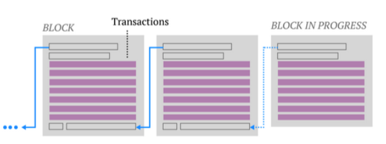
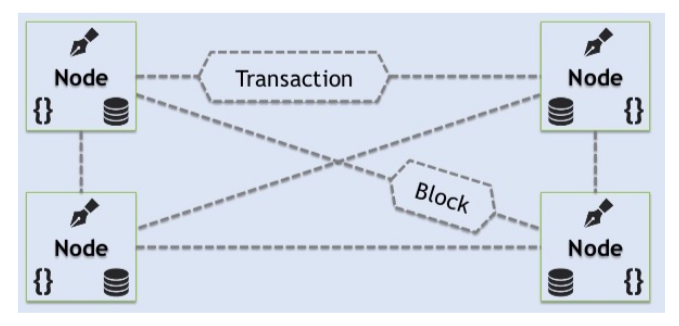
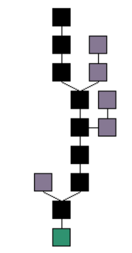
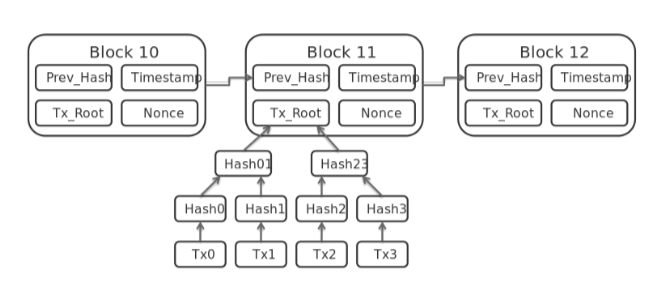
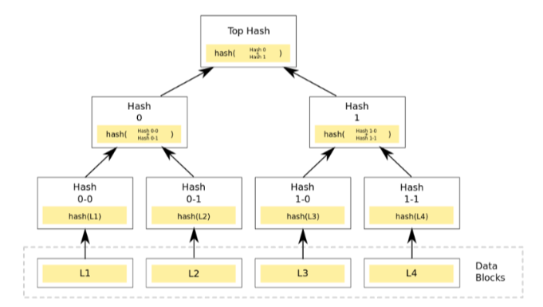
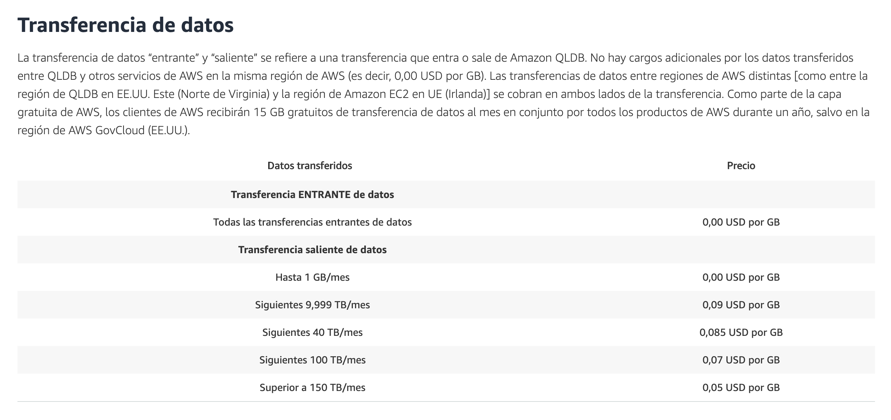
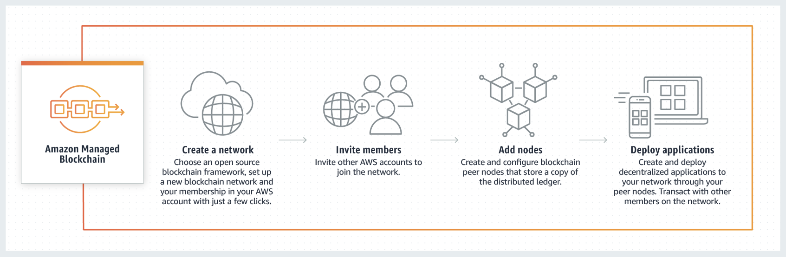
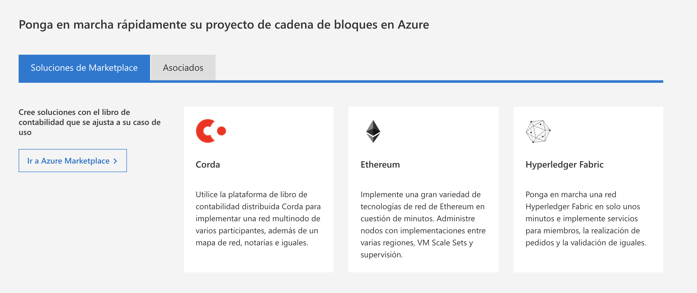

# BLOCKCHAIN, SUS APLICACIONES Y EL CLOUD

A lo largo de estos años es fácil que hayamos oido hablar de la palabra Blockchain, especialmente ligada al Bitcoin y resto de monedas. Pero, ¿qué es realmente el blockchain?

## INTRODUCCIÓN

Esta tecnología tuvo su origen como soporte para las transacciones con bitcoin, por lo fue originalmente utilizada por figuras que se oponían al sistema establecido y que querían conseguir independencia sobre un control central. 

Pensemos en un ejemplo concreto, en este caso una transacción monetaria y el rol que el bitcoin podría tener. Basicamente pagamos un dolar por algún bien material, pero esta transacción se realizó porque el valor de un dolar está representado por un billete, el cual fue creado por un Gobierno en el que ambas partes confían, que se reconocen y aceptan. Entonces cuando esta compra-venta se concreta, los detalles deben quedar escritos en un libro de cuentas.

En el caso de transacciones electrónicas entran en participación terceras partes fiables como bancos u operadores como  Paypal. Pero se sigue manejando una moneda centralizada como el dolar. Al final, las entidades financieras coordinan las operaciones y obtienen sus beneficios correspondientes.

La situación cambia cuando la moneda es virtual y no la emite una entidad financiera o administración. En este caso se garantiza la integridad y fiabilidad basándose en el consenso, que es donde entra en juego el blockchain. Esta cadena de bloques es una base de datos compartida que funciona como un libro para el registro de operaciones de compra-venta o cualquier otro tipo de transacción.

Se podróa decir que es un conjunto de apuntes que están en una base de datos compartida en la que se registran mediante códigos las transacciones realizadas. Al utilizar claves criptográficas y al estar distribuido por muchos ordenadores presenta ventajas en la seguridad frente a manipulaciones y fraudes, ya que una modificación en una de las copias seria inútil, ya que se debe realizar el cambio en todas las copias porque la base es abierta y pública [2]. En definitiva, la potencia de blockchains viene por la unión de sus tres grandes cualidades: irrefutable, irrevocable y distribuida.

## COMPONENTES

La tecnología está basada en cuatro fundamentos: 
    - El registro compartido de las transacciones. 
    - El consenso para verificar las transacciones.
    - Un contrato que determina las reglas de funcionamiento de las transacciones. 
    - La criptografía, que es el fundamento de todo[5]. 
    
Para esto se hacen uso de 3 componentes, los bloques, los mineros y los nodos, que ahora vamos a comentar.

### Bloques

Blockchain se basa en crear un registro de todas las transacciones, y estas se empaquetan en bloques que los mineros crean y luego se encargan de verificar. Una vez terminada su validación serán agregadas a la cadena y distribuidas a todos los nodos que forman la red. 

Por tanto, un bloque es un conjunto de transacciones confirmadas e información adicional que se ha incluido en la cadena de bloques. Cada bloque que forma parte de la cadena, menos el primer bloque que inicia la cadena, está formado por:

1. Un código alfanumérico que enlaza con el bloque anterior.
2. El “paquete” de transacciones que incluye.
3. Otro código alfanumérico que enlazará con el siguiente bloque.

### Mineros

Los mineros son ordenadores dedicados que aportan su poder computacional a la red para verificar las transacciones que se llevan a cabo. Son computadoras que se encargan de autorizar la adición de los bloques de transacción. Estos siguen los siguientes pasos[7]:

1. Las nuevas transacciones se transmiten a todos los nodos.
2. Cada nodo de la minería recoge nuevas transacciones en un bloque.
3. Cada nodo minero trabaja en la búsqueda de una prueba de trabajo para su bloque.
    - Prueba de trabajo: Un Sistema de prueba de trabajo o Sistema "POW" (del inglés Proof-Of-Work system), es un sistema que, para evitar comportamientos indeseados (por ejemplo ataques de denegación de servicio o spam), requiere que el cliente del servicio realice algún tipo de trabajo que tenga cierto coste y que es verificado fácilmente en la parte del servidor. Normalmente el trabajo consiste en realizar un cómputo en el ordenador del cliente.
4. Cuando un nodo de la minería encuentra y completa dicha prueba de trabajo, este transmite el bloque a todos los nodos.
5. Los demás nodos acepta el bloque sólo si todas las transacciones son válidas y no se hayan gastado.
6. Los nodos expresan su aceptación del bloque trabajando en la creación del próximo bloque en la cadena, utilizando el hash del bloque aceptado como el hash anterior.

Como sabréis, cada vez que alguien completa un bloque recibe una recompensa en forma de bitcoins y/o por cada transacción que se realiza.

### Nodos

Son computadoras conectadas a la red utilizando un software que almacena y distribuye una copia actualizada en tiempo real del blockchain.

Cada vez que un bloque se valida y se añade a la cadena, el cambio es comunicado a todos los nodos y este se añade a la copia que cada uno almacena. 

## CARACTERÍSTICAS Y FUNCIONAMIENTO

Las propiedades mas importantes para describir como funciona la tecnología blockchain son las siguientes: 

- Es de carácter descentralizado, pues esta no requiere un organismo o entidad central de confianza.
- Es una tecnología distribuida y de consenso, porque parte de unas reglas claras y un consenso sobre la validez de las transacciones y su estado. 
- Abierta tal que cualquier usuario puede hacer uso de ella. 
- Y segura gracias a la verificación criptográfica. [8]

Vamos a desgranar un poco más estos puntos.

### Descentralizado

Las redes blockchain son altamente escalables, descentralizadas y peer-to-peer. Es asi que, la integridad está basada en un mecanismo de consenso, en vez de una infraestructura basada en la confianza sobre un organismo central, como sería un banco u otra entidad financiera. La red P2P evita que un único participante o grupo controlen el sistema completo. Todos los integrantes de una red se adhieren, a los mismos protocolos, ya sean individuos, organizaciones o actores estatales. Las transacciones son irreversibles, por lo que una vez realizadas no pueden anularse, modificarse o revertirse.

Así, se eliminan los riesgos que vienen con los sistemas centralizados[10]. La red carece de puntos críticos o centrales de vulnerabilidad que podrían ser explotados. Los métodos de seguridad Blockchain incluyen el uso de la criptografía de clave pública: Una clave pública es una dirección en la cadena de bloque. Los tokens, como por ejemplo bitcoins, son enviados a través de la red y se registran como pertenecientes a esa dirección. Una clave privada es como una contraseña que le da acceso a su propietario a sus activos digitales.

-- 
Cada nodo o minero en un sistema descentralizado tiene una copia de la cadena de bloqueo. La calidad de los datos se mantiene mediante la replicación masiva de bases de datos[11]. No existe una copia oficial centralizada y ningún usuario es de más confianza que cualquier otro.
--

### Sistema abierto

Es abierto porque cualquier persona puede formar parte tan solo con descargándose el programa. Luego ella podrá realizar movimientos y transacciones -- con monedas virtuales -- y acceder a los datos registrados en su cadena de bloques.

A veces los bloques se pueden producir concurrentemente, creando un fork temporal. La cadena de bloques tiene un algoritmo especificado para marcar diferentes versiones de la cadena para que una con un valor más alto pueda ser seleccionada sobre otras. Los bloques no seleccionados para su inclusión en la cadena se denominan bloques húerfanos[12], como se observa en la figura 4.

Los peers de la red pueden tener de vez en cuando versiones diferentes de la base de datos. Estas solo guardan la versión con la puntuación más alta que conocen. Cada vez que un compañero recibe una versión de puntuación más alta (usualmente la versión antigua mas un solo bloque añadido) extienden o sobrescriben su propia base de datos y retransmiten la mejora a sus pares. Por ejemplo, en una cadena de bloques utilizando el sistema de prueba de trabajo, la cadena con la prueba de trabajo más acumulativa siempre es la considerada válida por la red.

### Seguridad

Los bloques que forman parte del blockchain son ordenados en la cadena por orden cronológico y tienen un código alfanumérico conocido como hash, que corresponde al bloque que los precede, gracias a ese hash todos están referenciados por el bloque que los creo, por lo que solo los bloques que contienen un código valido son introducidos en la cadena y replicados a todos los nodos. Es gracias a este método lo que hace virtualmente imposible modificar un bloque que ha sido introducido ya hace un cierto tiempo.

Los nodos mineros son los encargados de la creación de nuevos bloques de la cadena, computando y añadiendo luego a cada uno de ellos el hash y todas las nuevas transacciones correspondientes. Por lo tanto el blockchain nos permite llevar a cabo, una contabilidad publica de los movimientos realizados en la red de manera transparente, minimizando la posibilidad de fraude, no permitiendo la perdida de datos y con un sistema totalmente trazable.

Es necesario que los nodos que integran la red estén sincronizados manteniendo almacenada la cadena de bloques correcta, es decir la que esta actualizada. Como también observamos anteriormente, cada bloque contiene información sobre las transacciones de un periodo concreto, estas son almacenadas en una estructura denominada Merkle Tree (en honor a su creador: Ralph Merkle), también la información criptográfica del bloque precedente es decir, el código hash (Las funciones de hash, permiten parear strings de un tamañoo cualquiera a strings de tamaño fijo en una cantidad de tiempo razonable, en el caso de la moneda virtual Bitcoin se emplea la función hash criptográfica SHA-256, siendo sus apuntadores hash de un tamaño fijo de 256 bit), y un número único llamado nonce, el cual es un valor arbitrario que puede utilizarse una sola vez, es generado por los mineros mediante la prueba de trabajo (Proof of Work o PoW) y sirve como método sencillo para autenticar un bloque en caso de una posible modificación o reutilización de su contenido, sin tener que volver a procesar toda la cadena, ahorrando así mucho trabajo computacional.

Esta estructura de árbol binario, reúne pedazos de información y da como resultado un hash por cada uno de ellos, que vuelven a agruparse en pares y generan un nuevo hash que es agrupado con otro y así sucesivamente hasta alcanzar un único bloque raíz que se conoce como root hash, y es registrado en la dirección del bloque actual con el fin de reducir el espacio ocupado por cada bloque. Se puede observar un ejemplo en el gráfico 6:

Esta estructura permite recorrer cualquier nodo del árbol para la verificación de que ningún dato ha sido falsificado o adulterado.

Un bloque se verifica cuando el nonce, un número aleatorio que es utilizado una única vez, se encontró que, pasado por una función hash, proporciona un resultado menor que el valor objetivo. Una vez que el esfuerzo computacional satisface la prueba de trabajo, no se puede cambiar sin hacer de nuevo todo el trabajo, y, como los bloques están encadenados juntos, se deben calcular todos los bloques despúes de él también. Las pruebas de trabajo son esencialmente un sistema de una CPU, un voto. La decisión de la mayoría esta representada por la cadena mas larga, que tiene el mayor esfuerzo de pruebas de trabajo invertido. Para modificar un bloque pasado, para intentar robar bitcoins, un atacante debe rehacer todas las pruebas de trabajo y todos los bloques despúes de el y luego alcanzar y sobrepasar el trabajo de los nodos honestos[7].

Las cadenas de bloque también pueden utilizan otros esquemas de consenso, para serializar los cambios. Los métodos de consenso alternativos incluyen Proof of Stake y Proof of Burn.

## APLICACIONES

Blockchain tiene un gran potencial de transformar los modelos de operación de negocios a largo plazo. Es una tecnología fundacional con la capacidad de crear nuevas bases para la economía global y para los sistemas sociales. Su uso prom- ete traer incrementos significativos a la eficiencia de la cadena de suministro, transacciones financieras, libros de activos, y a la conexión social descentralizada.

Esta tecnología puede ser integrada en múltiples áreas y a continuación veremos algunas de ellas:

### Monedas digitales

Una de las aplicaciones mas populares del blockchain son las cryptomonedas o monedas digitales, bitcoin siendo la mas conocida de todas.

A principios del 2009 nació el Bitcoin de la mano de Satoshi Nakamoto, seudónimo que identifica a la persona o equipo que crearon la criptomoneda, que en la actualidad es la moneda digital más famosa, se crea, se transfiere y se deposita de forma electrónica, además está protegida criptográficamente.

Esta divisa digital es una moneda descentralizada, nadie pueda controlarla. Está fuera del alcance de gobiernos o bancos centrales. Esta independencia de un organismo central es la principal característica respecto al resto de monedas convencionales.

#### Funcionamiento de Bitcoin

Para empezar a utilizar bitcoin, primeramente se necesita de una billetera Bitcoin, donde se almacena las claves privadas que necesitamos para acceder a nuestras monedas. Estas billeteras pueden ser aplicaciones móviles o cuentas online en plataformas especializadas, algunas opciones disponibles son Bitcoin Core, Multibit, Armory, Blockchain.info, entre otras.

Como ya estábamos mencionando la tecnología que hace posible su funcionamiento es la cadena de bloques, todas las transacciones validas se agregan a la cadena, el orden cronológico del Blockchain facilita la seguridad que aporta la criptografía.

Una transacción en la red bitcoin es una transferencia con bitcoins que va de una billetera a otra, por lo tanto, cada transacción se incluye en la cadena de bloques. En los monederos (o billeteras) aparece una clave de firmas que valida la transacción. Estas transferencias suelen ser confirmadas rápidamente, mediante el proceso conocido como minería.

Este es un sistema de consenso distribuido que sirve para verificar los movimientos pendientes y agregarlos definitivamente a la cadena. Este proceso impide que un bloque anterior sea modificado o anulado, ya que produciría la corrupción e invalidez de los bloques posteriores.

##### Características de Bitcoin

– Utiliza blockchain como tecnología base. – Pagos rápidos P2P a nivel mundial.
– No tiene el problema del double-spend. – Bajos costos de procesamiento.
– Decentralizado
– Disponible a cualquiera, abierto. – Anonimato.
– Transparente.

### Smart Contracts

Una de sus aplicaciones emergentes más relevantes tiene que ver con lo que se conoce como “contratos inteligentes” o smart contracts.

En 1994, Nick Szabo, un jurista y criptógrafo, se dio cuenta de que un libro mayor descentralizado podría ser utilizado para realizar contratos digitales. En este formato los contratos pueden ser convertidos a código, guardados y replicados en el sistema y supervisados por la red de computadoras que corre el programa blockchain.

Los contratos inteligentes nos ayudan a intercambiar dinero, propiedades, activos o cualquier bien de valor de una manera sencilla, evitando los gastos por el servicio de intermediarios y sin revelar ningún tipo de información confidencial sobre las partes y/o naturaleza de la transacción.

Un ejemplo seria la venta o alquiler de un automóvil. Se podría hacerlo a través de blockchain pagando con monedas digitales. El comprador obtiene el recibo que es un smart contract, y la llave digital que llega a este en la fecha especificada. Si la llave no llega a tiempo, se le reembolsa el dinero. Si llega, ambas partes reciben lo acordado a tiempo. El sistema funciona con la premisa de Si-entonces y tiene como veedores a mucha gente, así que se puede esperar un delivery sin inconvenientes. Si te doy la llave, de seguro obtengo mi pago, si envías cierta cantidad de bitcoin por ejemplo, recibirás la llave del automóvil. El documento es automáticamente cancelado después de la fecha, y el código no puede ser interferido por ninguno sin que que el otro sepa ya que todos los participantes son alertados simultáneamente.

– Autonomía: Es uno mismo quien accede al acuerdo. No existen intermediarios, por lo que también se ahorra dinero.
– Confianza: Los documentos están encriptados en un shared-ledger. Nopueden perderse.
– Backup: Todos los miembros de la red tienen los documentos duplicados.
– Rapidez: Ahorro de tiempo en el procesamiento de documentos, papeleos manuales, etc.
– Seguridad: Obtenida gracias a la criptografía.

### Almacenamiento en la nube distribuido

Anteriormente las compañías hosteaban sus propios servidores en sus instalaciones, esto les daba mas control pero repercutía en los costos, también necesitaban expertos para que instalen y mantengan los servidores, sin mencionar la inversión en servidores de redundancia.

Es por esto que las organizaciones han optado por la nube. Con tentadoras ofertas se pueden obtener servicios confiables de storage y backup sin mucha preocupación.

Pero esta comodidad también tiene sus desventajas. Cuando utilizamos servicios en la nube, ponemos nuestra confianza en terceros, les confiamos nuestra información muchas veces delicada y de mucho valor.

Existen paralelos entre la infraestructura del almacenamiento en la nube y la infraestructura financiera. Es por eso que también puede ser mas eficiente y menos costosa utilizando blockchain.

Blockchain permite la creación de un mercado de almacenamiento distribuido y descentralizado. Algunos hosts de la red pueden vender su capacidad de storage sobrante y los que necesitan pueden pagar y subir sus archivos los cuales son encriptados, fragmentados y distribuidos inteligentemente por toda la cadena de bloques.

Con blockchain se pueden obtener:

– Completa descentralización y verdadera redundancia: Los datos son almacenados en decenas de nodos distribuidos por todo el mundo, y difícilmente puedan ser afectados por ataques.

– Privacidad total: Terceros no controlan datos de usuario ni tienen acceso a ellos. Cada nodo solo almacena los fragmentos de estos datos, y los usuarios controlan sus propias llaves.

– Reducciones de costo: En comparación el almacenamiento por blockchain cuesta alrededor de 2 dolares por terabyte al mes comparado con Amazon que demanda 25 dolares por terabite[14].

Storj es otra de las empresas que esta incursionando en este sector, es una startup la cual esta realizando pruebas de un un prototipo un servicio que permite que el almacenamiento remoto se haga de forma distribuida utilizando una red basada en la Blockchain para así aumentar la seguridad.

### Patentes/Registro de Propiedad

La cadena de bloques también puede ser aplicada al registro de patentes o de protección intelectual, ya que en cada bloque se puede introducir todo tipo de información, incluyendo fechas o timestamps.

Una empresa como Apple, o un artista, podría probar que ha creado una tecnología o una música respectivamente, en una fecha concreta sin necesidad de hacer una aplicación formal para registrar la patente.

Podría vincular esos documentos internos al hash de una transacción realizada en ese momento y probar así que ellos han sido los primeros en desarrollarla. De este modo, el autor conseguiría controlar el uso de su obra en formato digital y garantizar que se le remunere adecuadamente.

### Otras aplicaciones
     
    - Internet of Things
    - Voto electrónico
    - Gobierno transparente
    - Ecommerce
    - Identificación

## Blockchain as a Service

El BaaS significa que un proveedor de servicios externo proporciona toda la “tecnología e infraestructura de blockchain” necesaria para un cliente a cambio de un precio. Al pagar por el BaaS, el cliente paga al proveedor del BaaS para que este configure y mantenga los nodos conectados en el blockchain en su nombre. Un proveedor BaaS maneja el complejo back-end para el cliente y su negocio. 

El operador BaaS es responsable del buen funcionamiento de los componentes de software y la infraestructura asociados. También realiza funciones adicionales, como la gestión del ancho de banda, la asignación óptima de recursos, el cumplimiento de los requisitos de alojamiento así como funciones de seguridad, como la prevención de ataques de piratas informáticos. 

Al usar el modelo BaaS, en lugar de preocuparse por la infraestructura, el cliente puede concentrarse en su tarea principal, que no es otra que el funcionamiento de su propio blockchain y aumentar la productividad.

En definitiva la idea que sigue BaaS es que el proveedor nos proporciona toda la infraestructura y nosotros solo tenemos que lanzar nuestra aplicación. Aunque como veremos, esto aún esta empezando a desempeñarse.

### AMAZON

Encontramos dos servicios principalmente:

- Amazon Quantum Ledger Database (QLDB): 
    Base de datos de contabilidad completamente administrada en la que se proporciona un registro de transacciones transparente, inmutable y que se puede verificar mediante criptografía, cuya propiedad denota una autoridad central de confianza. Amazon QLDB registra cada uno de los cambios que se producen en los datos de las aplicaciones y mantiene un historial completo y que se pueda verificar.

    

    De hecho este servicio lo ofertan dentro del marco de blockchain, pero realmente no lo es. Esta BD te ofrece la filosofia del blockchain pero sin descentralización. El siguiente caso si lo sería.

    https://aws.amazon.com/es/qldb/faqs/

- Amazon Managed Blockchain: 
    Amazon Managed Blockchain es un servicio completamente administrado que facilita la creación y administración de redes de blockchain escalables mediante el uso de los marcos de código abierto populares Hyperledger Fabric y Ethereum (aún no disponible).

    Amazon Managed Blockchain es un servicio completamente administrado que le permite configurar y administrar una red de blockchain escalable con unos pocos clics. Con Amazon Managed Blockchain se elimina la sobrecarga que implica la creación de la red. Además, el servicio ajusta su escala automáticamente para satisfacer las demandas de miles de aplicaciones que ejecutan millones de transacciones. Una vez que su red esté funcionando, se facilitará la tarea de administrar y mantener su red de cadenas de bloques con Managed Blockchain. El servicio administra sus certificados, le permite invitar de forma sencilla a nuevos miembros para que se unan a la red y, además, realiza un seguimiento de las métricas operacionales como, por ejemplo, el uso de recursos informáticos, de memoria y almacenamiento. Además, Managed Blockchain puede replicar una copia inmutable de su actividad de red de cadenas de bloques a Amazon Quantum Ledger Database (QLDB), una base de datos de libro mayor completamente administrada. Esto le permite analizar fácilmente la actividad de la red de manera externa y obtener información acerca de las tendencias.

    En definitiva te está proporcionando toda la capacidad del Cloud y de un proveedor como viene siendo Amazon, pero haciendo uso de los marcos de trabajo (empresas) que están a la vanguardia de esta tecnología.

    

### AZURE

- Azure Blockchain Workbench :
    El banco de trabajo Azure Blockchain es la manera más rápida de empezar con el blockchain en Azure. Esta herramienta permite a los desarrolladores desplegar un libro mayor de cadenas de bloques junto con un conjunto de servicios relevantes de Azure que se utilizan con más frecuencia para construir una aplicación basada en cadenas de bloques. En lugar de pasar horas configurando la infraestructura necesaria y los servicios cloud, hemos automatizado el largo andamiaje para simplificar el desarrollo y permitir a los usuarios centrarse en la lógica de la aplicación y los flujos de trabajo.

Basicamente lo que te proporcionan son unas plantillas con las que tu puedes construir tu topologia de red para desplegar más rapidamente.

## NOTAS

- BUSCAR ALGUN EJEMPLO POR EJEMPLO DE SMART CONTRACTS EN ALGÚN PROVEEDOR PRINCIPAL

## Cuestiones

- ¿Es totalmente seguro blockchain?
- Si por ejemplo bitcoin ocupa 170 GB, ya que el blockchain hace uso de la replicación de datos en cada base de datos.... esto en cloud no estaría generando una replicación innecesaria?

# ENLACES

## Explicación

- Qué es blockchain: la explicación definitiva para la tecnología más de moda => https://www.xataka.com/especiales/que-es-blockchain-la-explicacion-definitiva-para-la-tecnologia-mas-de-moda
- Blockchain: la transferencia de datos digitales no centralizada => https://blog.mdcloud.es/blockchain-la-transferencia-datos-digitales-no-centralizada/
- Cadena de bloques en AWS => https://aws.amazon.com/es/blockchain/

## Principios

- Descentralización, inmutabilidad y seguridad de los datos, las claves de Blockchain => https://www.indracompany.com/es/blogneo/descentralizacion-inmutabilidad-seguridad-datos-claves-blockchain
- ¿Es 'blockchain' realmente inmutable? => https://www.bbva.com/es/blockchain-realmente-inmutable/

## Blockchain as a service

- Will the cloud move to the blockchain? => https://hackernoon.com/will-the-cloud-move-to-the-blockchain-6ceabd0ce664
- Los proveedores 'cloud' ya se preparan para ofrecer 'blockchain as a service' => https://www.computerworld.es/tendencias/los-proveedores-cloud-ya-se-preparan-para-ofrecer-blockchain-as-a-service
- Qué es 'Blockchain as a Service' y por qué es interesante para las empresas => https://www.bbva.com/es/blockchain-as-service-puede-interesar-negocio/
- 19 BLOCKCHAIN-AS-A-SERVICE COMPANIES MAKING THE DLT MORE ACCESSIBLE => https://builtin.com/blockchain/blockchain-as-a-service-companies
- How to choose a Blockchain as a Service BaaS provider => https://www.ledgerinsights.com/how-to-blockchain-as-a-service-baas/
- Why Blockchain As A Service Solutions Aren’t Blockchains => https://hackernoon.com/why-blockchain-as-a-service-solutions-arent-blockchains-8d588b1f35ce
- Blockchain-as-a-Service  => https://www.investopedia.com/terms/b/blockchainasaservice-baas.asp

- https://es.ihodl.com/tutorials/2018-05-23/blockchain-service-como-funciona/

## Varios (Predicciones - Robos - Usos -  )

- 8 Predicciones Que Marcarán Blockchain En 2019: https://www.revistacloudcomputing.com/2019/01/8-predicciones-que-marcaran-blockchain-en-2019/
- "Bandido blockchain": Cómo un hacker ha estado robando millones de dólares de ETH al adivinar claves privadas débiles => https://es.cointelegraph.com/news/blockchain-bandit-how-a-hacker-has-been-stealing-millions-worth-of-eth-by-guessing-weak-private-keys
- Blockchain: Qué es y cuales podrían ser sus usos y ventajas en la Industria 4.0: https://grupogaratu.com/que-es-blockchain-usos-y-ventajas/
- Blockchain: 5 aplicaciones más allá del Bitcoin => https://www.globbit.com/blockchain-5-aplicaciones-mas-alla-del-bitcoin-13032/
- BlockCloud: Re-inventing Cloud with Blockchains => https://guardtime.com/blog/blockcloud-re-inventing-cloud-with-blockchains
- El impacto del blockchain en la ciberserguridad => https://www.pandasecurity.com/spain/mediacenter/seguridad/blockchain-ciberserguridad/

## IBM CLOUD

- https://www.ibm.com/developerworks/ssa/views/cloud/libraryview.jsp?sort_by=&show_abstract=true&show_all=&search_flag=&contentarea_by=Cloud+computing&search_by=Blockchain&product_by=-1&topic_by=-1&industry_by=-1&type_by=Todos+los+Tipos&ibm-search=Buscar
- INTERESANTE => https://www.ibm.com/developerworks/ssa/cloud/library/cl-blockchain-basics-intro-bluemix-trs/index.html
- https://cloud.ibm.com/catalog/services/blockchain
- INTERESANTE => https://cloud.ibm.com/docs/services/blockchain?topic=blockchain-develop-smart-contracts
- https://cloud.ibm.com/docs/blockchain?topic=blockchain-blockchain-component-overview

## Principales

- https://www.computerworld.es/tendencias/los-proveedores-cloud-ya-se-preparan-para-ofrecer-blockchain-as-a-service
- https://www.bbva.com/es/blockchain-as-service-puede-interesar-negocio/
- https://www.coincrispy.com/2018/05/23/como-funciona-blockchain-as-a-service-baas/
- https://es.ihodl.com/tutorials/2018-05-23/blockchain-service-como-funciona/
- https://aws.amazon.com/es/blockchain/
- https://aws.amazon.com/es/qldb/faqs/
- https://aws.amazon.com/es/managed-blockchain/
- https://azure.microsoft.com/es-es/features/blockchain-workbench/